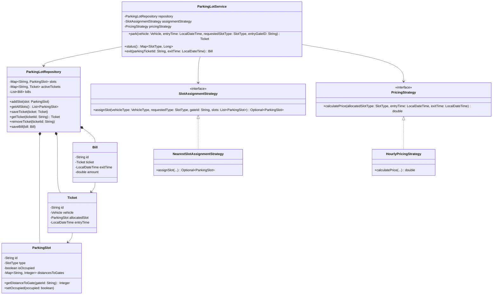

# Multilevel Parking Lot System

A Java-based Low-Level Design (LLD) implementation of a Multilevel Parking Lot system that I built to solve this problem statement.

## My Design and Approach

I designed this system with a strong focus on maintainability, scalability, and adherence to object-oriented SOLID principles. 

### Key Concepts & Design Patterns

1.  **SOLID Principles:**
    *   **Single Responsibility Principle (SRP):** I explicitly separated concerns into distinct classes. My core business orchestrations reside in `ParkingLotService`, data management lives in `ParkingLotRepository`, while the complex algorithms have their own strategy classes.
    *   **Open/Closed Principle (OCP):** I made sure the system easily scales without modifying core logic. I can introduce dynamic pricing or new VIP slot assignment algorithms by simply adding new strategy implementations.
    *   **Dependency Inversion Principle (DIP):** The main service `ParkingLotService` injects behavioral abstractions (`PricingStrategy`, `SlotAssignmentStrategy`) instead of coupling tightly to concrete logic.

2.  **Design Patterns Used:**
    *   **Strategy Pattern:** 
        *   `SlotAssignmentStrategy`: Dictates how a slot is acquired. My `NearestSlotAssignmentStrategy` specifically searches for the exact `requestedSlotType` first. If all preferred slots are occupied, the algorithm gracefully falls back to looking for the nearest available, compatible larger slot.
        *   `PricingStrategy`: Abstracts billing mechanics. My `HourlyPricingStrategy` ensures billing relies on the *allocated* slot type rate rather than the raw vehicle type (which is essential for when I park a BIKE in a LARGE slot).
    *   **Repository Pattern:** `ParkingLotRepository` acts as my in-memory data store. It mocks the behavior of a genuine database, decoupling storage logic from my application logic.

3.  **Core Functional Flows:**
    *   **Park:** When a vehicle enters, I take its vehicle type, preferred slot size, and entry gate ID. My engine evaluates compatibility (e.g., Cars cannot park in Small slots), finds the nearest valid fallback option slot, reserves it, and issues a standard `Ticket`.
    *   **Status:** A simple extraction of unoccupied `ParkingSlot` objects, grouped mathematically by `SlotType`.
    *   **Exit:** Using the `Ticket` ID, the software fetches entry times and the attached `ParkingSlot`. It unbinds the occupation status from the slot, processes duration math, creates a final `Bill`, and safely deletes the active ticket.

## Class Diagram



## How to Run locally

1. Navigate to the core `src` directory containing the `com` folder.
2. Compile the Java files:
   ```bash
   javac $(find . -name "*.java")
   ```
3. Run the demonstration (`Main.java`):
   ```bash
   java com.parkinglot.Main
   ```
